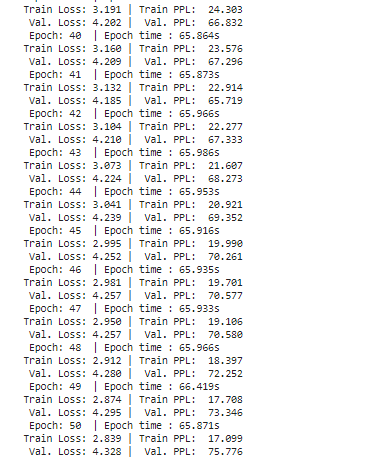
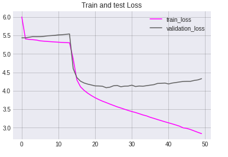

# Translation With a Sequence to Sequence Transformer

> by Krishna N Revi 

## Assignment ❔

1. Take the code discussed in class, and make it work with any dataset. Submit the GitHub repo's ReadMe file, where I can see answers to these questions:
   - what dataset you have used
   - what problem have you solved (fill in the blank, translation, text generation, etc)
   - the output of your training for 10 epochs

## Solution 💡

Please refer to complete solution [here](https://github.com/krishnarevi/TSAI_END2.0_Session12/blob/main/NMT_Transformer.ipynb)

### Task

 Build a Transformer model to perform German to English translation

### Dataset

We will be using Multi30K dataset for our German to English translation model. Multi30K is a dataset to stimulate multilingual multimodal research for English-German. It is based on the Flickr30k dataset, which contains 31,014 images sourced from online photo-sharing websites. Each image is paired with five English descriptions, which were collected from Amazon Mechanical Turk. The dataset contains 145,000 [training](http://www.quest.dcs.shef.ac.uk/wmt16_files_mmt/training.tar.gz), 5,070 [development]( http://www.quest.dcs.shef.ac.uk/wmt16_files_mmt/validation.tar.gz), and 5,000 [test](http://www.quest.dcs.shef.ac.uk/wmt16_files_mmt/mmt16_task1_test.tar.gz)  descriptions. The Multi30K dataset extends the Flickr30K dataset with translated and independent German sentences. 

### Model

```python
Transformer(
  (encoder): Encoder(
    (word_embedding): Embedding(19215, 512)
    (position_embedding): Embedding(100, 512)
    (layers): ModuleList(
      (0): TransformerBlock(
        (attention): SelfAttention(
          (values): Linear(in_features=64, out_features=64, bias=False)
          (keys): Linear(in_features=64, out_features=64, bias=False)
          (queries): Linear(in_features=64, out_features=64, bias=False)
          (fc_out): Linear(in_features=512, out_features=512, bias=True)
        )
        (norm1): LayerNorm((512,), eps=1e-05, elementwise_affine=True)
        (norm2): LayerNorm((512,), eps=1e-05, elementwise_affine=True)
        (feed_forward): Sequential(
          (0): Linear(in_features=512, out_features=2048, bias=True)
          (1): ReLU()
          (2): Linear(in_features=2048, out_features=512, bias=True)
        )
        (dropout): Dropout(p=0, inplace=False)
      )
      (1): TransformerBlock(
        (attention): SelfAttention(
          (values): Linear(in_features=64, out_features=64, bias=False)
          (keys): Linear(in_features=64, out_features=64, bias=False)
          (queries): Linear(in_features=64, out_features=64, bias=False)
          (fc_out): Linear(in_features=512, out_features=512, bias=True)
        )
        (norm1): LayerNorm((512,), eps=1e-05, elementwise_affine=True)
        (norm2): LayerNorm((512,), eps=1e-05, elementwise_affine=True)
        (feed_forward): Sequential(
          (0): Linear(in_features=512, out_features=2048, bias=True)
          (1): ReLU()
          (2): Linear(in_features=2048, out_features=512, bias=True)
        )
        (dropout): Dropout(p=0, inplace=False)
      )
      (2): TransformerBlock(
        (attention): SelfAttention(
          (values): Linear(in_features=64, out_features=64, bias=False)
          (keys): Linear(in_features=64, out_features=64, bias=False)
          (queries): Linear(in_features=64, out_features=64, bias=False)
          (fc_out): Linear(in_features=512, out_features=512, bias=True)
        )
        (norm1): LayerNorm((512,), eps=1e-05, elementwise_affine=True)
        (norm2): LayerNorm((512,), eps=1e-05, elementwise_affine=True)
        (feed_forward): Sequential(
          (0): Linear(in_features=512, out_features=2048, bias=True)
          (1): ReLU()
          (2): Linear(in_features=2048, out_features=512, bias=True)
        )
        (dropout): Dropout(p=0, inplace=False)
      )
      (3): TransformerBlock(
        (attention): SelfAttention(
          (values): Linear(in_features=64, out_features=64, bias=False)
          (keys): Linear(in_features=64, out_features=64, bias=False)
          (queries): Linear(in_features=64, out_features=64, bias=False)
          (fc_out): Linear(in_features=512, out_features=512, bias=True)
        )
        (norm1): LayerNorm((512,), eps=1e-05, elementwise_affine=True)
        (norm2): LayerNorm((512,), eps=1e-05, elementwise_affine=True)
        (feed_forward): Sequential(
          (0): Linear(in_features=512, out_features=2048, bias=True)
          (1): ReLU()
          (2): Linear(in_features=2048, out_features=512, bias=True)
        )
        (dropout): Dropout(p=0, inplace=False)
      )
      (4): TransformerBlock(
        (attention): SelfAttention(
          (values): Linear(in_features=64, out_features=64, bias=False)
          (keys): Linear(in_features=64, out_features=64, bias=False)
          (queries): Linear(in_features=64, out_features=64, bias=False)
          (fc_out): Linear(in_features=512, out_features=512, bias=True)
        )
        (norm1): LayerNorm((512,), eps=1e-05, elementwise_affine=True)
        (norm2): LayerNorm((512,), eps=1e-05, elementwise_affine=True)
        (feed_forward): Sequential(
          (0): Linear(in_features=512, out_features=2048, bias=True)
          (1): ReLU()
          (2): Linear(in_features=2048, out_features=512, bias=True)
        )
        (dropout): Dropout(p=0, inplace=False)
      )
      (5): TransformerBlock(
        (attention): SelfAttention(
          (values): Linear(in_features=64, out_features=64, bias=False)
          (keys): Linear(in_features=64, out_features=64, bias=False)
          (queries): Linear(in_features=64, out_features=64, bias=False)
          (fc_out): Linear(in_features=512, out_features=512, bias=True)
        )
        (norm1): LayerNorm((512,), eps=1e-05, elementwise_affine=True)
        (norm2): LayerNorm((512,), eps=1e-05, elementwise_affine=True)
        (feed_forward): Sequential(
          (0): Linear(in_features=512, out_features=2048, bias=True)
          (1): ReLU()
          (2): Linear(in_features=2048, out_features=512, bias=True)
        )
        (dropout): Dropout(p=0, inplace=False)
      )
    )
    (dropout): Dropout(p=0, inplace=False)
  )
  (decoder): Decoder(
    (word_embedding): Embedding(10838, 512)
    (position_embedding): Embedding(100, 512)
    (layers): ModuleList(
      (0): DecoderBlock(
        (norm): LayerNorm((512,), eps=1e-05, elementwise_affine=True)
        (attention): SelfAttention(
          (values): Linear(in_features=64, out_features=64, bias=False)
          (keys): Linear(in_features=64, out_features=64, bias=False)
          (queries): Linear(in_features=64, out_features=64, bias=False)
          (fc_out): Linear(in_features=512, out_features=512, bias=True)
        )
        (transformer_block): TransformerBlock(
          (attention): SelfAttention(
            (values): Linear(in_features=64, out_features=64, bias=False)
            (keys): Linear(in_features=64, out_features=64, bias=False)
            (queries): Linear(in_features=64, out_features=64, bias=False)
            (fc_out): Linear(in_features=512, out_features=512, bias=True)
          )
          (norm1): LayerNorm((512,), eps=1e-05, elementwise_affine=True)
          (norm2): LayerNorm((512,), eps=1e-05, elementwise_affine=True)
          (feed_forward): Sequential(
            (0): Linear(in_features=512, out_features=2048, bias=True)
            (1): ReLU()
            (2): Linear(in_features=2048, out_features=512, bias=True)
          )
          (dropout): Dropout(p=0, inplace=False)
        )
        (dropout): Dropout(p=0, inplace=False)
      )
      (1): DecoderBlock(
        (norm): LayerNorm((512,), eps=1e-05, elementwise_affine=True)
        (attention): SelfAttention(
          (values): Linear(in_features=64, out_features=64, bias=False)
          (keys): Linear(in_features=64, out_features=64, bias=False)
          (queries): Linear(in_features=64, out_features=64, bias=False)
          (fc_out): Linear(in_features=512, out_features=512, bias=True)
        )
        (transformer_block): TransformerBlock(
          (attention): SelfAttention(
            (values): Linear(in_features=64, out_features=64, bias=False)
            (keys): Linear(in_features=64, out_features=64, bias=False)
            (queries): Linear(in_features=64, out_features=64, bias=False)
            (fc_out): Linear(in_features=512, out_features=512, bias=True)
          )
          (norm1): LayerNorm((512,), eps=1e-05, elementwise_affine=True)
          (norm2): LayerNorm((512,), eps=1e-05, elementwise_affine=True)
          (feed_forward): Sequential(
            (0): Linear(in_features=512, out_features=2048, bias=True)
            (1): ReLU()
            (2): Linear(in_features=2048, out_features=512, bias=True)
          )
          (dropout): Dropout(p=0, inplace=False)
        )
        (dropout): Dropout(p=0, inplace=False)
      )
      (2): DecoderBlock(
        (norm): LayerNorm((512,), eps=1e-05, elementwise_affine=True)
        (attention): SelfAttention(
          (values): Linear(in_features=64, out_features=64, bias=False)
          (keys): Linear(in_features=64, out_features=64, bias=False)
          (queries): Linear(in_features=64, out_features=64, bias=False)
          (fc_out): Linear(in_features=512, out_features=512, bias=True)
        )
        (transformer_block): TransformerBlock(
          (attention): SelfAttention(
            (values): Linear(in_features=64, out_features=64, bias=False)
            (keys): Linear(in_features=64, out_features=64, bias=False)
            (queries): Linear(in_features=64, out_features=64, bias=False)
            (fc_out): Linear(in_features=512, out_features=512, bias=True)
          )
          (norm1): LayerNorm((512,), eps=1e-05, elementwise_affine=True)
          (norm2): LayerNorm((512,), eps=1e-05, elementwise_affine=True)
          (feed_forward): Sequential(
            (0): Linear(in_features=512, out_features=2048, bias=True)
            (1): ReLU()
            (2): Linear(in_features=2048, out_features=512, bias=True)
          )
          (dropout): Dropout(p=0, inplace=False)
        )
        (dropout): Dropout(p=0, inplace=False)
      )
      (3): DecoderBlock(
        (norm): LayerNorm((512,), eps=1e-05, elementwise_affine=True)
        (attention): SelfAttention(
          (values): Linear(in_features=64, out_features=64, bias=False)
          (keys): Linear(in_features=64, out_features=64, bias=False)
          (queries): Linear(in_features=64, out_features=64, bias=False)
          (fc_out): Linear(in_features=512, out_features=512, bias=True)
        )
        (transformer_block): TransformerBlock(
          (attention): SelfAttention(
            (values): Linear(in_features=64, out_features=64, bias=False)
            (keys): Linear(in_features=64, out_features=64, bias=False)
            (queries): Linear(in_features=64, out_features=64, bias=False)
            (fc_out): Linear(in_features=512, out_features=512, bias=True)
          )
          (norm1): LayerNorm((512,), eps=1e-05, elementwise_affine=True)
          (norm2): LayerNorm((512,), eps=1e-05, elementwise_affine=True)
          (feed_forward): Sequential(
            (0): Linear(in_features=512, out_features=2048, bias=True)
            (1): ReLU()
            (2): Linear(in_features=2048, out_features=512, bias=True)
          )
          (dropout): Dropout(p=0, inplace=False)
        )
        (dropout): Dropout(p=0, inplace=False)
      )
      (4): DecoderBlock(
        (norm): LayerNorm((512,), eps=1e-05, elementwise_affine=True)
        (attention): SelfAttention(
          (values): Linear(in_features=64, out_features=64, bias=False)
          (keys): Linear(in_features=64, out_features=64, bias=False)
          (queries): Linear(in_features=64, out_features=64, bias=False)
          (fc_out): Linear(in_features=512, out_features=512, bias=True)
        )
        (transformer_block): TransformerBlock(
          (attention): SelfAttention(
            (values): Linear(in_features=64, out_features=64, bias=False)
            (keys): Linear(in_features=64, out_features=64, bias=False)
            (queries): Linear(in_features=64, out_features=64, bias=False)
            (fc_out): Linear(in_features=512, out_features=512, bias=True)
          )
          (norm1): LayerNorm((512,), eps=1e-05, elementwise_affine=True)
          (norm2): LayerNorm((512,), eps=1e-05, elementwise_affine=True)
          (feed_forward): Sequential(
            (0): Linear(in_features=512, out_features=2048, bias=True)
            (1): ReLU()
            (2): Linear(in_features=2048, out_features=512, bias=True)
          )
          (dropout): Dropout(p=0, inplace=False)
        )
        (dropout): Dropout(p=0, inplace=False)
      )
      (5): DecoderBlock(
        (norm): LayerNorm((512,), eps=1e-05, elementwise_affine=True)
        (attention): SelfAttention(
          (values): Linear(in_features=64, out_features=64, bias=False)
          (keys): Linear(in_features=64, out_features=64, bias=False)
          (queries): Linear(in_features=64, out_features=64, bias=False)
          (fc_out): Linear(in_features=512, out_features=512, bias=True)
        )
        (transformer_block): TransformerBlock(
          (attention): SelfAttention(
            (values): Linear(in_features=64, out_features=64, bias=False)
            (keys): Linear(in_features=64, out_features=64, bias=False)
            (queries): Linear(in_features=64, out_features=64, bias=False)
            (fc_out): Linear(in_features=512, out_features=512, bias=True)
          )
          (norm1): LayerNorm((512,), eps=1e-05, elementwise_affine=True)
          (norm2): LayerNorm((512,), eps=1e-05, elementwise_affine=True)
          (feed_forward): Sequential(
            (0): Linear(in_features=512, out_features=2048, bias=True)
            (1): ReLU()
            (2): Linear(in_features=2048, out_features=512, bias=True)
          )
          (dropout): Dropout(p=0, inplace=False)
        )
        (dropout): Dropout(p=0, inplace=False)
      )
    )
    (fc_out): Linear(in_features=512, out_features=10838, bias=True)
    (dropout): Dropout(p=0, inplace=False)
  )
)
```

The model has 51,225,686 trainable parameters

##### Training hyperparameters

Epochs = 100

Learning_rate = 2e-4

Batch size = 32


### Results 

##### Train and validation logs :




##### Train - validation loss and perplexity:

#####  

```python
Train Loss: 2.839 | Train PPL:  17.099
Val. Loss: 4.328 |  Val. PPL:  75.776
```

##### Bleu score of test set : 25.6

##### Sample prediction :

```
src = Eine Blondine hält mit einem Mann im Sand Händchen.
trg = A blond holding hands with a guy in the sand.
predicted trg =  A man in a black shirt and a woman in a pink shirt and hat . 
```

We trained for 50 epochs still bleu score is pretty low and predictions are not correct .
